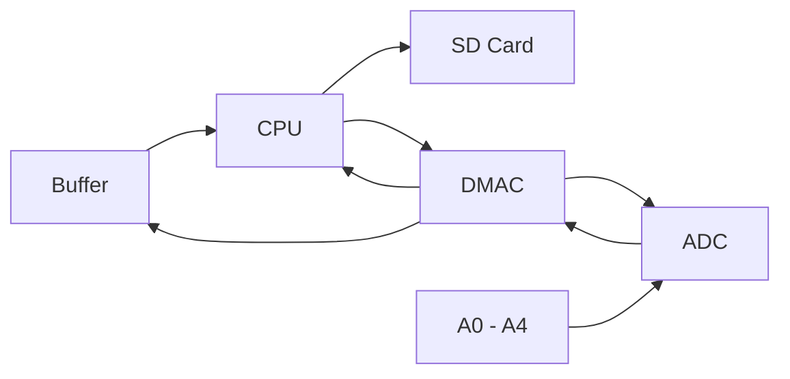

---
{"dg-publish":true,"dg-path":"IRIS/IRIS.md","permalink":"/iris/iris/","tags":["gardenEntry"],"noteIcon":"","created":"2024-08-23T14:09:13.301-07:00","updated":"2024-09-14T17:33:09.621-07:00"}
---

Welcome to the IRIS Notes! This site was made in Obsidian using the [Digital Garden extension](https://dg-docs.ole.dev/), hosted on [GitHub](https://github.com/Baron-Paelen/iris-notes-site), and deployed using [Vercel](https://vercel.com). Many of the pages here heavily paraphrase or quote the [SAMD51 Datasheet](https://ww1.microchip.com/downloads/aemDocuments/documents/MCU32/ProductDocuments/DataSheets/SAM-D5x-E5x-Family-Data-Sheet-DS60001507.pdf).

The purpose of this website is to hopefully demystify the software side of IRIS by presenting a more digestible version of the SAMD51's datasheet. As of the creation of this website, we've started migrating to the [[20 - Professional/21 - SCIPP/21.01 - IRIS/IRIS-Notes-Site/docs/M4 Board\|M4 Board]], so most of the specifics will be tailored to the SAMD51/M4 board. 

Below you will find the currently available notes.

- [[20 - Professional/21 - SCIPP/21.01 - IRIS/IRIS/ADC\|ADC]]
- **Code Analysis**
    - [[20 - Professional/21 - SCIPP/21.01 - IRIS/IRIS/Code Analysis/raidersnake's ADC multiplexing\|raidersnake's ADC multiplexing]]
- [[20 - Professional/21 - SCIPP/21.01 - IRIS/IRIS/DMA Controller\|DMA Controller]]
- [[20 - Professional/21 - SCIPP/21.01 - IRIS/IRIS/IRIS\|IRIS]]
- [[20 - Professional/21 - SCIPP/21.01 - IRIS/IRIS/M4 Board\|M4 Board]]
- [[20 - Professional/21 - SCIPP/21.01 - IRIS/IRIS/Power Saving Options\|Power Saving Options]]
- [[20 - Professional/21 - SCIPP/21.01 - IRIS/IRIS/Resources\|Resources]]

# Our Approach
## The Problem
The problem we're solving can be boiled down to orchestrating the following:
1. Generate readings from *4 input pins* via the ADC.
2. Store these readings in a comprehensible order/format on an SD card.
3. Collect the data at a frequency *over 1kHz*.

## The Breakdown
This is essentially a variation of the [Producer-Consumer Problem](https://en.wikipedia.org/wiki/Producer%E2%80%93consumer_problem). Obviously, there are things we must work around first due to hardware constraints:

3. Since the M0/M4 has a single core, reading from the ADC and writing to SD *cannot be done concurrently* by the CPU.
4. Since we have more input pins than ADCs, the readings will be *staggered*, causing long gaps between a pin's readings.
	- If using the ADC's averaging modes, these gaps will be even longer. Since the M4 has 2 ADCs, this problem is easier to handle, but requires more configuration.
5. Since SD cards write in 512 byte chunks and writes have noticeable latency, we must buffer the incoming data for efficiency's sake (N\*512 bytes).
6. Since the CPU's write to SD takes some time, then we must make sure the buffer always holds data that represents events across this time. Meaning, the data should be spaced out relative to the time it takes for the CPU to write one buffer to SD.

Based on the above, the workflow should look something like this:

- **CPU**
	- Writes instructions and configurations to the DMAC
	- Writes the sample buffers to SD card when triggered
- **DMAC**
	- Flags/Triggers the CPU to begin writes when buffer is ready
	- Writes instructions and configurations to ADC via sequencing
- **ADC**
	- Flags DMAC once a result is ready
- **Buffer**
	- Holds ADC results in multiples of 512 bytes
- **Pins**
	- 4 input pins for the ADC
## M0 Approach
The original approach for collecting IRIS data used a [M0 Adalogger](https://www.adafruit.com/product/2796). It comes with a built in SD shield and the ability to use a small LiPo battery for independent operation. The main flaw with this board was the write latency - a single write would take about half a millisecond, which is far too long. 

Another flaw lay in the fact that the M0 only has 1 ADC, and the staggered readings between the 4 input pins introduced large gaps for each pin between SD writes. This means there are less datapoints between SD writes for each pin.

## M4 Approach
In order to allow concurrent data collection and SD writing, we use the M4's SAMD51's [[20 - Professional/21 - SCIPP/21.01 - IRIS/IRIS/DMA Controller\|DMA controller]] to control the 2 onboard [[20 - Professional/21 - SCIPP/21.01 - IRIS/IRIS/ADC\|ADCs]]. The DMAC is configured to collect samples from the ADCs into a buffer. Once the buffer is filled, the CPU begins the process of writing the buffer's contents into the SD card. The DMAC then starts new conversions on the ADCs.

